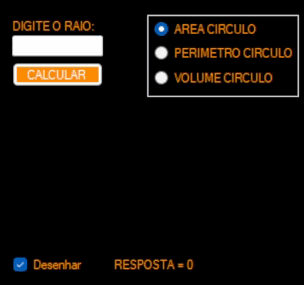

<h1 align="center">
   Calculadora
</h1>

 

## 💻 Projeto

O projeto consiste em uma calculadora que ira calcular Area, Perimetro e Volume de uma circuferencia dando a opçao de mostrar um desenho do objeto

## :camera: Demonstração

  

## ⚙ Configuração

Requisitos: 
- Visual Studio 

Download:
- Baixar o arquivo e extrair
- Executar no Visual Studio

## :rocket: Tecnologias

Esse projeto foi desenvolvido com a seguinte tecnologia:

✔️ C#

---
